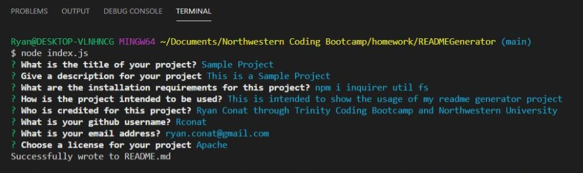
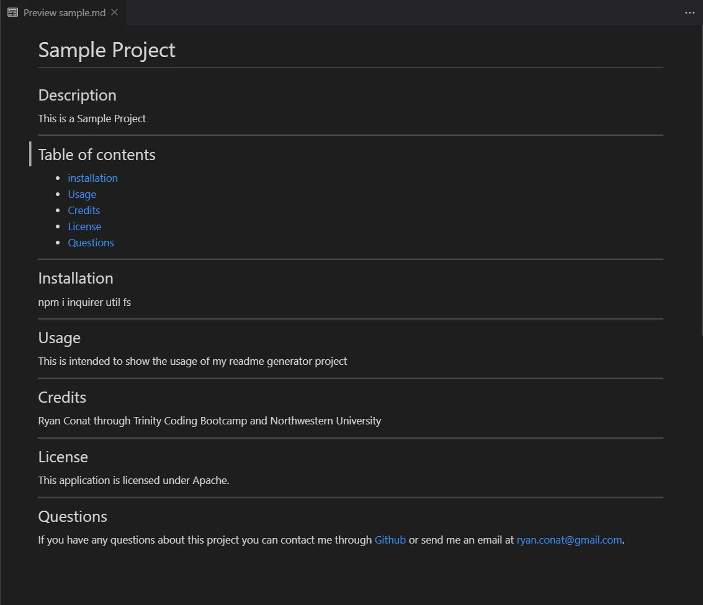

# README Generator
## Description 

The purpose of this project is to provide a way to automatically generate a README file through console commands via the terminal. This project can generate an effective README for any project and by any user.

You can find the repo on [GitHub](https://github.com/Rconat/READMEGenerator).

---

Terminal Prompts

Sample Walkthrough - Click the .gif below for the full video

Sample README

---

## Table of Contents

* [Installation](#installation)
* [List of Files](#List-of-Files)
* [Usage](#usage)
* [Credits](#credits)

---
## Installation
This project requires Node.js to run. It also requires the use of the inquirer, fs, and util node packages. To install them  run the following command in the terminal in the project file.

    npm install inquirer fs util

---

## List of Files

<ul>
    <li>index.js</li>
    <li>generateMarkdown.js</li>
    <li>package-lock.json</li>
    <li>package.json</li>
    <li>README.md</li>
    <li>readmeWalkthrough.gif</li>
    <li>sample.jpg</li>
    <li>sample.md</li>
    <li>terminal.jpg</li>
</ul>

---

## Usage
This project can be used to easily create a readme file for any project. A user must first head to their terminal in this projects folder file. From there the user will enter the following code in their terminal.

    node index.js

Upon entering this command and hitting the "Enter" key the user will be prompted with a set of questions about the project. When the user has finished answering all the questions the program will respond with 'Successfully wrote to README.md' and the readme will be created.

---

## Credits

This project was created my Ryan Conat working alongside professors and TAs through Trinity and Northwestern Coding Bootcamp to provide the assignment parameters.